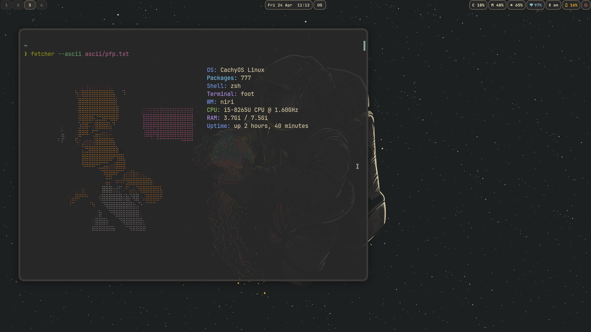

#+title: README . but I do it
#+DESCRIPTION: A minimalist, universal system information tool written in Python.
#+AUTHOR: hamzadotjs

*  Compatibility
This script is designed to work on:
- Arch Linux / CachyOS (via pacman)
- Debian / Ubuntu / Mint (via apt)
- Fedora / RHEL (via dnf)

* Quick Start
** 1. Clone the repository
#+begin_SRC bash
git clone https://github.com/hamzadotjs/Fetcher.git
#+END_SRC
** 2. Run the Universal Installer
#+BEGIN_SRC bash
chmod +x install.sh
./install.sh
#+END_SRC
*  Manual Build (Optional)
#+BEGIN_SRC bash
pyinstaller --onefile fetcher.py
ln -sf $(pwd)/dist/fetcher ~/.local/bin/
#+END_SRC
* Uninstallation
#+BEGIN_SRC
rm -rf ~/.local/bin/fetcher
rm -rf ~/Fecthcer
#+END_SRC

* Screenshots:
 file:./fetcher-regular.png
 
